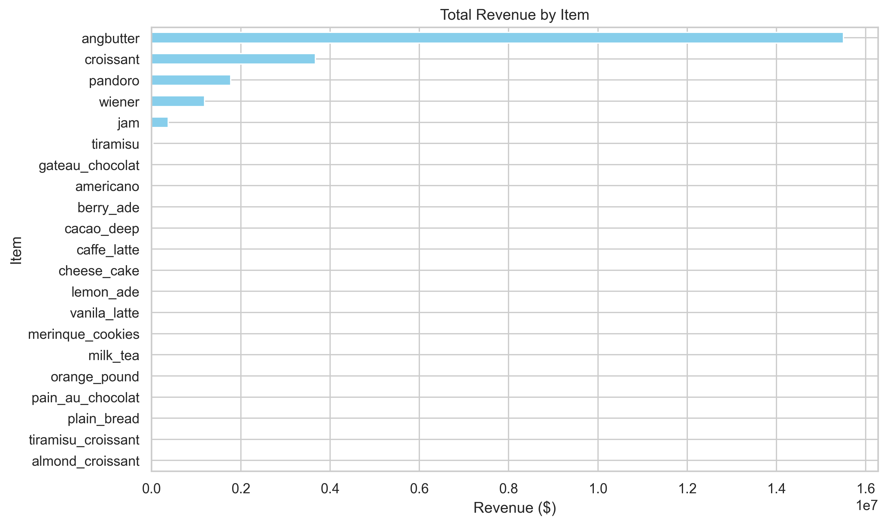
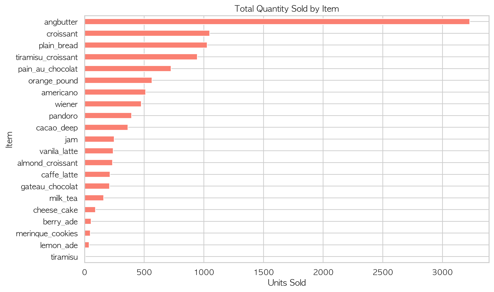
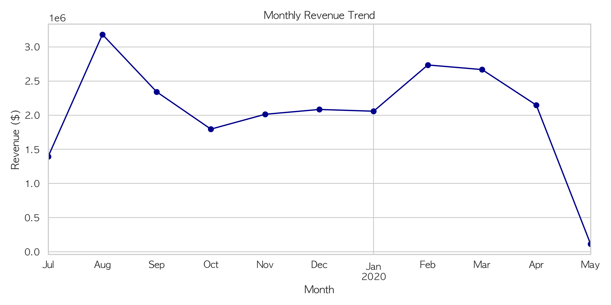
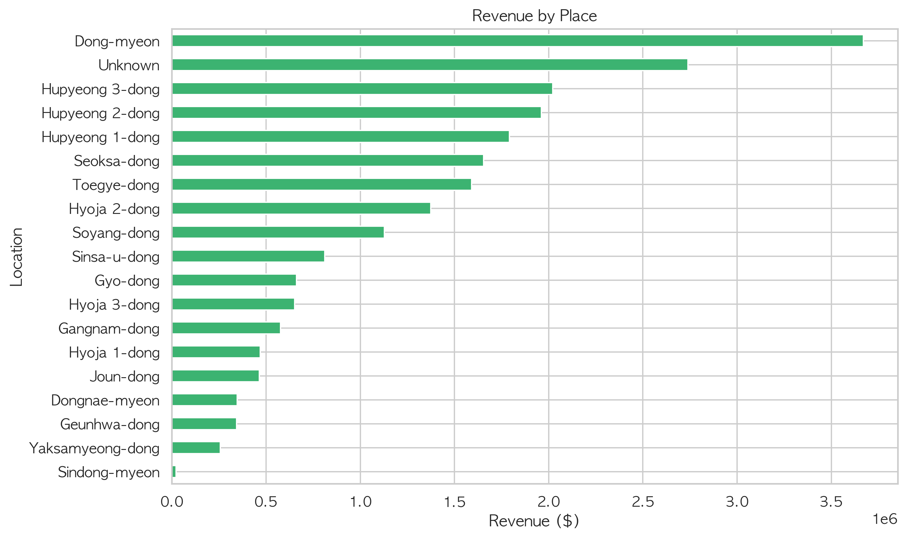
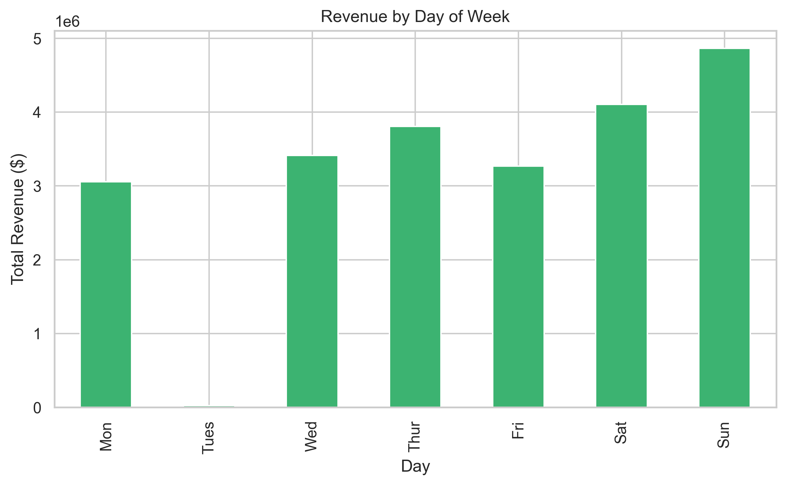
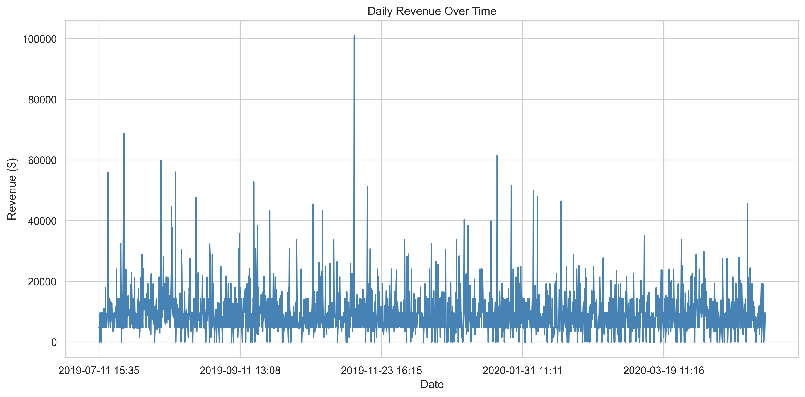

# Local Business Analysis Project

This project analyzes sales data from a local business to uncover key business metrics and visualize trends for better decision-making.

---------------------------

## Project Objectives

- Identify key performance indicators (KPIs) for the business.
- Clean and prepare the data for analysis.
- Perform exploratory data analysis (EDA).
- Visualize trends and patterns using Matplotlib & Seaborn.
- Build a dashboard-style Jupyter Notebook with clear steps and markdowns.

---------------------------

## Dataset

The dataset includes:
- **Order information**
- **Revenue**
- **Locations (in Korean, translated to English)**
- **Dates and times**
- **Items sold**

---------------------------

## Key Metrics Calculated

- Total Revenue
- Number of Orders
- Revenue per Order
- Average Revenue per Day
- Monthly Revenue Breakdown
- Revenue by Location
- Revenue by Day of the Week

---------------------------

## Data Cleaning

- Filled missing values (`NaN`)
- Translated Korean place names to English
- Removed duplicates
- Standardized column formatting

---------------------------

## Visualizations

### Revenue per Order

This chart shows how much revenue each item generated.

### Quantity Sold per Item

This helped compare item popularity with how much money they earned.

### Monthly Revenue Trends

This helped identify seasonality or spikes in business.

### Revenue by Location (Bar Chart)

A side-by-side bar chart comparing revenue across store locations.

### Revenue by Day of the Week

This chart shows which days generated the most income — weekends were strongest.

### Revenue Over Time

Line chart of total revenue by day to spot spikes, trends, and lulls.

---------------------------

## Tools Used

- Python (Pandas, NumPy)
- Jupyter Notebook
- Matplotlib & Seaborn
- Google Translate (for location name conversion)

---------------------------

## Insights

- Highest sales occurred in specific locations like `Hyoja 3-dong` and `Siksa-dong`.
- Revenue was highest in the month of August.
- Saturdays and Sundays consistently had higher order volumes.
- Some items contributed significantly more to revenue per order.

---------------------------

## Future Improvements

- Build an interactive dashboard with Streamlit
- Add customer segmentation analysis
- Integrate data from other sources (marketing, foot traffic, etc.)

---------------------------

## Author

Beverly Ajuzie  
Aspiring Data Analyst  
LinkedIn: https://www.linkedin.com/in/beverly-ajuzie-77b87325b/
